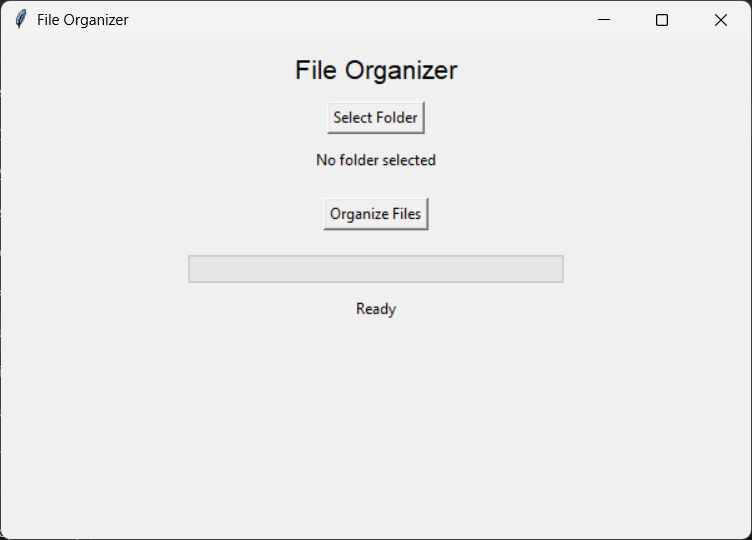

# 📁 Python File Organizer

A desktop application built with Python and Tkinter that automatically organizes files into folders based on their file extensions.

## 🚀 Features

- 🖥️ Simple and user-friendly GUI
- 📂 Select any folder using a folder picker
- 📁 Automatically organize files by type
- 📊 Live progress bar
- 🔄 Duplicate file handling
- 📝 File organization logs
- ⚙️ Custom categories using `config.json`
- 📦 Standalone Windows executable (.exe)

---

## 📂 Supported Categories

| Category | Extensions |
|----------|------------|
| Images | .jpg, .jpeg, .png, .gif, .bmp |
| Documents | .pdf, .docx, .txt, .xlsx, .pptx |
| Audio | .mp3, .wav, .aac |
| Videos | .mp4, .avi, .mkv |
| Applications | .exe, .msi, .apk |

Categories can easily be customized by editing `config.json`.

---

## 📸 Screenshot

```markdown

```

---

## 🛠️ Technologies Used

- Python 3
- Tkinter
- JSON
- Logging
- PyInstaller

---

## 📦 Installation

Clone the repository

```bash
git clone https://github.com/Somay-Yadav/Python-File-Organizer.git
```

Go to the project folder

```bash
cd File-Organizer
```

Install dependencies

```bash
pip install -r requirements.txt
```

Run the application

```bash
python main.py
```

---

## 📁 Project Structure

```
File-Organizer/
│
├── main.py
├── organizer.py
├── config.json
├── requirements.txt
├── README.md
├── .gitignore
├── assets/
│   └── screenshot.png
└── organizer.log
```

---

## 📦 Build Executable

```bash
python -m PyInstaller --onefile --windowed --name FileOrganizer --add-data "config.json;." main.py
```

The executable will be available inside the `dist` folder.

---

## 🎯 Future Improvements (V3)

- 🎨 Modern UI (CustomTkinter)
- 🌙 Dark Mode
- 📊 File statistics
- 🔍 Preview before organizing
- ↩️ Undo last organization
- 🖼️ Custom application icon
- 💾 Remember last selected folder
- 📂 Drag & Drop support

---

## 🤝 Contributing

Pull requests are welcome.

Feel free to fork this project and improve it.

---

## 📄 License

This project is licensed under the MIT License.

---

Made with ❤️ using Python.